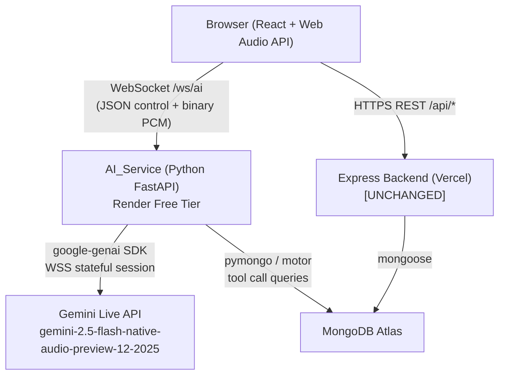
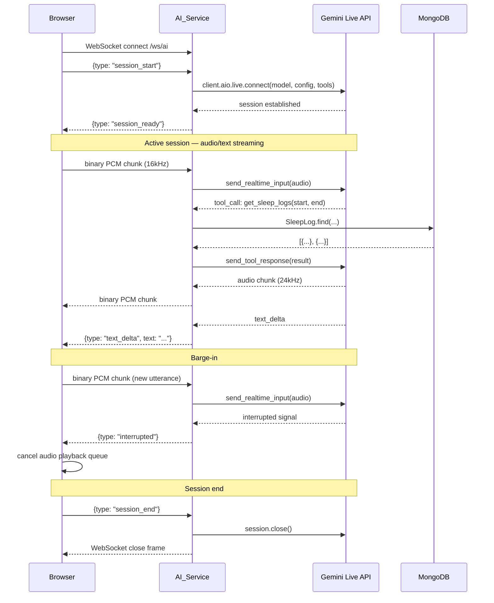

# Design Document: Realtime AI Assistant

## Overview

The Realtime AI Assistant adds a voice-and-text conversational interface to the existing health tracking app. Users can speak or type natural language questions about their sleep, water, gym, diet, and clean timer data and receive spoken and text responses grounded in their actual MongoDB records.

The architecture introduces a new Python FastAPI service (AI_Service) deployed on Render's free tier. This service acts as a stateful relay between the React frontend and the Google Gemini Live API. It maintains a persistent WebSocket connection to Gemini Live for the duration of each user session, executes tool calls against MongoDB Atlas when Gemini requests data, and streams raw PCM audio bidirectionally between the browser and Gemini. The existing Express backend on Vercel is completely untouched.

Key design constraints:
- Free-tier operation: Gemini Live free tier is 10 RPM / 250 RPD
- Single-user app: no auth layer needed, `DEFAULT_USER_ID` used throughout
- Sub-second audio latency: PCM chunks relayed immediately, no buffering
- Barge-in and VAD handled natively by Gemini Live — no custom logic in AI_Service

---

## Architecture



### Component Responsibilities

| Component | Responsibility |
|---|---|
| Browser / Assistant_UI | Mic capture (AudioWorklet), PCM playback queue, chat UI, WebSocket client |
| AI_Service | WebSocket server, Gemini Live session relay, tool call executor, MongoDB queries |
| Gemini Live API | Speech recognition, NLU, response generation, VAD, barge-in, tool call invocation |
| MongoDB Atlas | Persistent health data store (shared with Express backend) |
| Express Backend | All existing REST endpoints — no changes |

---

## Components and Interfaces

### AI_Service (Python FastAPI)

```
ai_service/
  main.py              # FastAPI app, CORS, startup
  ws_handler.py        # WebSocket endpoint /ws/ai — browser ↔ AI_Service relay
  gemini_session.py    # Manages Live API session lifecycle via google-genai SDK
  tool_handlers.py     # MongoDB query functions for each data domain
  tools_schema.py      # Gemini tool definitions (JSON schema)
  db.py                # Motor async MongoDB client
  config.py            # Env vars: GEMINI_API_KEY, MONGODB_URI, CLIENT_ORIGIN
```

**WebSocket endpoint:** `ws://<render-host>/ws/ai`

The handler runs two concurrent async tasks per connection:
1. `browser_to_gemini`: reads messages from the browser WebSocket, routes binary frames as audio chunks to the Live session, routes JSON control messages (text input, session config) to the Live session.
2. `gemini_to_browser`: reads events from the Live session, routes audio output chunks as binary frames to the browser, routes text/tool-call events as JSON to the browser.

**Gemini session initialization** (on WebSocket connect):
```python
client = genai.Client(api_key=GEMINI_API_KEY)
session = await client.aio.live.connect(
    model="gemini-2.5-flash-native-audio-preview-12-2025",
    config=LiveConnectConfig(
        system_instruction=build_system_prompt(),
        tools=TOOL_DEFINITIONS,
        response_modalities=["AUDIO", "TEXT"],
        input_audio_config=AudioConfig(sample_rate_hertz=16000),
        output_audio_config=AudioConfig(sample_rate_hertz=24000),
    )
)
```

### Assistant_UI (React)

```
client/src/components/assistant/
  AssistantUI.jsx          # Root component: session state, WebSocket lifecycle
  ChatHistory.jsx          # Scrollable conversation history
  ChatInput.jsx            # Text input field + send button
  VoiceControls.jsx        # Mic button, mute toggle, visual indicators
  useAssistantSession.js   # Hook: WebSocket, session state, turn counter
  useAudioCapture.js       # Hook: AudioWorklet mic capture → PCM chunks
  useAudioPlayback.js      # Hook: PCM playback queue via Web Audio API
  pcm-processor.js         # AudioWorkletProcessor: mic → 16-bit PCM chunks
```

**AudioWorklet processor** (`pcm-processor.js`) runs in a dedicated audio thread:
- Receives float32 samples from the mic
- Converts to Int16 (multiply by 32767, clamp)
- Posts the Int16Array buffer to the main thread via `port.postMessage`

**PCM playback queue** (`useAudioPlayback.js`):
- Maintains an ordered queue of `AudioBuffer` objects
- Each incoming binary WebSocket frame (24kHz PCM) is decoded into an `AudioBuffer` and enqueued
- Buffers are scheduled back-to-back using `AudioBufferSourceNode.start(nextStartTime)`
- On interruption signal, all queued buffers are cancelled and `nextStartTime` is reset

### WebSocket Message Protocol

All non-audio messages are JSON. Audio is sent as raw binary frames.

**Browser → AI_Service:**

| Message type | Direction | Format | Description |
|---|---|---|---|
| `session_start` | JSON | `{type: "session_start"}` | Triggers Gemini Live session creation |
| `session_end` | JSON | `{type: "session_end"}` | Closes Gemini Live session |
| `text_input` | JSON | `{type: "text_input", text: string}` | User typed message |
| `audio_chunk` | Binary | `ArrayBuffer` (Int16, 16kHz) | Raw PCM mic audio |
| `mute_audio` | JSON | `{type: "mute_audio", muted: boolean}` | Mute state change (informational) |

**AI_Service → Browser:**

| Message type | Direction | Format | Description |
|---|---|---|---|
| `session_ready` | JSON | `{type: "session_ready"}` | Gemini session established |
| `text_delta` | JSON | `{type: "text_delta", text: string, turn_id: string}` | Streaming text token |
| `text_done` | JSON | `{type: "text_done", turn_id: string}` | Text response complete |
| `audio_chunk` | Binary | `ArrayBuffer` (Int16, 24kHz) | Raw PCM audio output |
| `interrupted` | JSON | `{type: "interrupted"}` | Barge-in detected, stop playback |
| `tool_call_start` | JSON | `{type: "tool_call_start", tool: string}` | Tool call in progress (UI feedback) |
| `error` | JSON | `{type: "error", message: string, code: string}` | Error from AI_Service or Gemini |
| `turn_limit_warning` | JSON | `{type: "turn_limit_warning", turn_count: number}` | Turn count ≥ 20 |

---

## Data Models

### Tool Call Definitions

All tool calls accept `user_id` implicitly (hardcoded to `DEFAULT_USER_ID` in AI_Service). Date parameters use `yyyy-MM-dd` string format matching the existing MongoDB `date` field.

#### Tool: `get_sleep_logs`
```json
{
  "name": "get_sleep_logs",
  "description": "Fetch sleep log entries for a date range",
  "parameters": {
    "start_date": {"type": "string", "description": "yyyy-MM-dd"},
    "end_date":   {"type": "string", "description": "yyyy-MM-dd"}
  }
}
```
MongoDB query:
```python
SleepLog.find({
    "userId": DEFAULT_USER_ID,
    "date": {"$gte": start_date, "$lte": end_date},
    "isComplete": True
}).limit(30)
```
Returns per document: `date`, `duration`, `quality`, `sleptAt`, `wokeUpAt`, `isComplete`

#### Tool: `get_water_logs`
```json
{
  "name": "get_water_logs",
  "description": "Fetch daily water intake stats for a date range",
  "parameters": {
    "start_date": {"type": "string"},
    "end_date":   {"type": "string"}
  }
}
```
MongoDB query (against `DailyStats` collection):
```python
DailyStats.find({
    "userId": DEFAULT_USER_ID,
    "date": {"$gte": start_date, "$lte": end_date}
}).limit(30)
```
Returns per document: `date`, `totalMl`, `goal`, `goalMet`, `entryCount`

#### Tool: `get_gym_logs`
```json
{
  "name": "get_gym_logs",
  "description": "Fetch gym workout logs for a date range",
  "parameters": {
    "start_date": {"type": "string"},
    "end_date":   {"type": "string"}
  }
}
```
MongoDB query:
```python
GymLog.find({
    "userId": DEFAULT_USER_ID,
    "date": {"$gte": start_date, "$lte": end_date}
}).limit(30)
```
Returns per document: `date`, `workoutType`, `primaryMuscle`, `secondaryMuscle`, `primaryExercises`, `secondaryExercises`, `duration`

#### Tool: `get_diet_logs`
```json
{
  "name": "get_diet_logs",
  "description": "Fetch diet/meal log entries for a date range",
  "parameters": {
    "start_date":  {"type": "string"},
    "end_date":    {"type": "string"},
    "food_filter": {"type": "string", "description": "Optional substring filter on foodName"}
  }
}
```
MongoDB query:
```python
query = {"userId": DEFAULT_USER_ID, "date": {"$gte": start_date, "$lte": end_date}}
if food_filter:
    query["foodName"] = {"$regex": food_filter, "$options": "i"}
DietLog.find(query).limit(30)
```
Returns per document: `date`, `foodName`, `calories`, `protein`, `carbs`, `fat`, `fiber`, `eatenAt`

#### Tool: `get_clean_timers`
```json
{
  "name": "get_clean_timers",
  "description": "Fetch all active clean timer records",
  "parameters": {}
}
```
MongoDB query:
```python
CleanTimer.find({"userId": DEFAULT_USER_ID, "isActive": True})
```
Returns per document: `habitName`, `startedAt`, `isActive`, `category`, `resetCount` (len of resetHistory), `lastResetAt` (most recent resetHistory entry date or null)

### Session State (AI_Service, per WebSocket connection)

```python
@dataclass
class SessionState:
    gemini_session: Any          # google-genai Live session object
    turn_count: int              # incremented on each user utterance
    tool_call_count: int         # reset each turn, max 5
    conversation_history: list   # last 10 turns for context window management
```

### Session State (Browser, React)

```typescript
interface AssistantSessionState {
  status: "idle" | "connecting" | "active" | "reconnecting" | "error";
  turns: Turn[];                  // full conversation history for display
  isMuted: boolean;
  isListening: boolean;
  isSpeaking: boolean;
  reconnectAttempts: number;      // max 3
  turnCount: number;              // for usage warning at 20+
}

interface Turn {
  id: string;
  role: "user" | "assistant";
  text: string;
  timestamp: number;
}
```

---

## Session Lifecycle



### Reconnection Flow

On unexpected WebSocket drop, the browser:
1. Sets status to `"reconnecting"`, disables input
2. Attempts reconnect after 2s (up to 3 times)
3. On success: sends `session_start`, restores `turns` array in UI (history not lost)
4. On 3rd failure: sets status to `"error"`, displays error message

Note: Gemini Live session state is not preserved across reconnects — a new Live session is created. Conversation history displayed in the UI is preserved client-side.

---

## Deployment

### AI_Service on Render Free Tier

**`render.yaml`:**
```yaml
services:
  - type: web
    name: ai-service
    runtime: python
    buildCommand: pip install -r requirements.txt
    startCommand: uvicorn main:app --host 0.0.0.0 --port $PORT
    envVars:
      - key: GEMINI_API_KEY
        sync: false
      - key: MONGODB_URI
        sync: false
      - key: CLIENT_ORIGIN
        sync: false
```

**`requirements.txt`:**
```
fastapi
uvicorn[standard]
google-genai
motor
python-dotenv
```

**CORS configuration** (in `main.py`):
```python
app.add_middleware(
    CORSMiddleware,
    allow_origins=[os.getenv("CLIENT_ORIGIN"), "http://localhost:5173"],
    allow_credentials=True,
    allow_methods=["*"],
    allow_headers=["*"],
)
```

WebSocket connections are not subject to CORS in the same way as HTTP, but the `CLIENT_ORIGIN` check is applied in the WebSocket handshake headers.

### Environment Variables

| Variable | Service | Description |
|---|---|---|
| `GEMINI_API_KEY` | AI_Service | Google AI Studio API key |
| `MONGODB_URI` | AI_Service | Same Atlas connection string as Express backend |
| `CLIENT_ORIGIN` | AI_Service | Vercel frontend URL for CORS |
| `VITE_AI_SERVICE_URL` | Browser | WebSocket URL, e.g. `wss://ai-service.onrender.com` |

### Free Tier Constraints

- Render free tier: service spins down after 15 min inactivity — first connection may take ~30s cold start. The existing `ServerWakeupAnimation` component pattern can be reused.
- Gemini Live: 10 RPM, 250 RPD. Each WebSocket connect = 1 session = 1 request against RPM. The 10 RPM limit applies to session creation, not individual turns within a session.
- History truncation to last 10 turns and tool call results capped at 30 records keep token usage bounded.

---

## Error Handling

| Scenario | AI_Service behavior | Browser behavior |
|---|---|---|
| Gemini API key invalid | Close WebSocket with `error` message | Display error, disable session start |
| MongoDB query timeout | Return empty result to Gemini with error note | No direct user impact |
| Tool call limit exceeded (>5/turn) | Return error to Gemini, stop further tool calls | No direct user impact |
| WebSocket drop (browser side) | Detect close event, close Gemini session, release resources | Auto-reconnect up to 3 times |
| Gemini session error | Send `{type: "error"}` to browser, close WebSocket | Display error message |
| Microphone permission denied | N/A | Display permission error, disable voice input |
| AudioWorklet not supported | N/A | Display fallback message, text-only mode |
| Partial stream on disconnect | N/A | Display partial text received, show reconnect button |

---

## Correctness Properties

*A property is a characteristic or behavior that should hold true across all valid executions of a system — essentially, a formal statement about what the system should do. Properties serve as the bridge between human-readable specifications and machine-verifiable correctness guarantees.*

### Property 1: Audio relay preserves chunks unchanged

*For any* PCM audio chunk (binary frame) received by the AI_Service from either the browser or the Gemini Live session, the chunk forwarded to the other side should be byte-for-byte identical to the received chunk.

**Validates: Requirements 2.2, 3.1**

---

### Property 2: Conversation history grows monotonically within a session

*For any* sequence of N user turns within a single session, the `turns` array in the browser session state should contain exactly N entries, each preserving the original text and role, in arrival order.

**Validates: Requirements 1.3, 1.5**

---

### Property 3: Error messages are always user-readable strings

*For any* `{type: "error"}` message received from the AI_Service, the `message` field should be a non-empty string, and the Assistant_UI should remain mounted (not crash).

**Validates: Requirements 1.4**

---

### Property 4: Tool call date range filter is strict

*For any* tool call with `start_date` S and `end_date` E, every document in the returned result set should have a `date` field D satisfying `S <= D <= E`. No document outside the range should appear in the result.

**Validates: Requirements 5.4, 5.5**

---

### Property 5: Tool call result size is bounded

*For any* tool call invocation, the number of documents returned should be at most 30.

**Validates: Requirements 11.3**

---

### Property 6: Tool call invocation count per turn is bounded

*For any* single user turn, the AI_Service should invoke at most 5 tool calls before returning a response. The `tool_call_count` counter on `SessionState` should never exceed 5 within a single turn.

**Validates: Requirements 5.6**

---

### Property 7: Tool call responses contain all required fields

*For any* tool call result document, the returned JSON object should contain all fields specified for that domain:
- Sleep: `date`, `duration`, `quality`, `sleptAt`, `wokeUpAt`, `isComplete`
- Water: `date`, `totalMl`, `goal`, `goalMet`, `entryCount`
- Gym: `date`, `workoutType`, `primaryMuscle`, `secondaryMuscle`, `primaryExercises`, `secondaryExercises`, `duration`
- Diet: `date`, `foodName`, `calories`, `protein`, `carbs`, `fat`, `fiber`, `eatenAt`
- Clean Timer: `habitName`, `startedAt`, `isActive`, `category`, `resetCount`, `lastResetAt`

**Validates: Requirements 6.2, 7.2, 8.2, 9.2, 10.2**

---

### Property 8: Sleep aggregation excludes incomplete entries

*For any* set of sleep logs containing a mix of complete (`isComplete: true`) and incomplete (`isComplete: false`) entries, the computed average duration and quality distribution should be calculated using only the complete entries. The count of incomplete entries should be reported separately.

**Validates: Requirements 6.3, 6.4**

---

### Property 9: Diet totals are the sum of individual entries

*For any* set of diet log entries for a given date range, the reported total calories, protein, carbs, and fat should equal the arithmetic sum of the corresponding fields across all entries in the set.

**Validates: Requirements 9.3**

---

### Property 10: Diet food name filter returns only matching entries

*For any* `food_filter` string F and any set of diet log entries, every entry in the returned result should have a `foodName` that contains F as a case-insensitive substring. No entry with a non-matching `foodName` should appear in the result.

**Validates: Requirements 9.4**

---

### Property 11: Clean timer streak calculation is correct

*For any* CleanTimer document with a known `startedAt` timestamp and a `resetHistory` array, the computed current streak in days should equal `floor((now - max(startedAt, lastResetAt)) / 86400)` where `lastResetAt` is the most recent entry in `resetHistory`, or `startedAt` if `resetHistory` is empty.

**Validates: Requirements 10.3**

---

### Property 12: Conversation history sent to Gemini is truncated to last 10 turns

*For any* session with N total turns where N > 10, the history payload sent to the Gemini Live API should contain exactly the 10 most recent turns. For N ≤ 10, all turns should be included.

**Validates: Requirements 11.2**

---

### Property 13: Turn limit warning fires at threshold

*For any* session where the turn count reaches or exceeds 20, the AI_Service should emit a `turn_limit_warning` message to the browser. For any session with fewer than 20 turns, no such message should be emitted.

**Validates: Requirements 11.4**

---

### Property 14: New session clears previous history

*For any* prior session state with N turns, starting a new session should result in a `turns` array of length 0 and `turnCount` of 0 in the browser session state.

**Validates: Requirements 12.2**

---

### Property 15: System prompt contains required content including current date

*For any* Gemini Live session created by the AI_Service, the system prompt passed to `LiveConnectConfig` should contain: (a) today's date in `yyyy-MM-dd` format, (b) the instruction to use tool calls before answering data questions, and (c) the instruction to keep responses under 100 words unless detail is requested.

**Validates: Requirements 13.1, 13.2, 13.4**

---

### Property 16: Interruption signal stops audio playback queue

*For any* browser state where the audio playback queue is non-empty, receiving an `{type: "interrupted"}` message should result in the playback queue being cleared and `isSpeaking` being set to false.

**Validates: Requirements 4.3**

---

### Property 17: Reconnect attempts are bounded at 3

*For any* unexpected WebSocket disconnection during an active session, the browser should attempt reconnection at most 3 times. After 3 failed attempts, the status should transition to `"error"` and no further reconnection attempts should be made.

**Validates: Requirements 15.3**

---

### Property 18: Session context is preserved across successful reconnection

*For any* active session with N turns that experiences a WebSocket drop followed by a successful reconnection, the `turns` array displayed in the UI should still contain all N turns after reconnection completes.

**Validates: Requirements 15.5**

---

### Property 19: Mute state suppresses audio playback

*For any* session state where `isMuted` is true, receiving a binary audio chunk from the AI_Service should not result in any audio being scheduled or played via the Web Audio API. The chunk should be silently discarded.

**Validates: Requirements 3.4**

---

### Property 20: PCM playback queue preserves chunk order

*For any* sequence of audio chunks C1, C2, ..., Cn received from the AI_Service in that order, the audio buffers should be scheduled for playback in the same order, with each buffer starting at or after the end time of the previous buffer.

**Validates: Requirements 3.2**

---

## Testing Strategy

### Dual Testing Approach

Both unit tests and property-based tests are required. They are complementary:
- Unit tests catch concrete bugs at specific inputs and integration points
- Property-based tests verify universal correctness across the full input space

### Python (AI_Service) — Hypothesis

Property-based testing library: **Hypothesis** (`pip install hypothesis`)

Each property test runs a minimum of 100 examples (Hypothesis default). Tests are tagged with a comment referencing the design property.

```python
# Feature: realtime-ai-assistant, Property 4: Tool call date range filter is strict
@given(
    start=st.dates(min_value=date(2020,1,1), max_value=date(2026,12,31)),
    end=st.dates(min_value=date(2020,1,1), max_value=date(2026,12,31)),
    records=st.lists(st.fixed_dictionaries({
        "date": st.dates(min_value=date(2019,1,1), max_value=date(2027,12,31))
                   .map(lambda d: d.isoformat()),
        "duration": st.integers(min_value=0, max_value=1440),
    }))
)
def test_date_range_filter_strict(start, end, records):
    assume(start <= end)
    result = apply_date_filter(records, start.isoformat(), end.isoformat())
    for doc in result:
        assert start.isoformat() <= doc["date"] <= end.isoformat()
```

Property tests to implement (Python):
- Property 4: date range filter strictness (`tool_handlers.py`)
- Property 5: result size bounded at 30 (`tool_handlers.py`)
- Property 6: tool call count per turn bounded at 5 (`ws_handler.py`)
- Property 7: required fields present in tool call responses (`tool_handlers.py`)
- Property 8: sleep aggregation excludes incomplete entries (`tool_handlers.py`)
- Property 9: diet totals are sum of entries (`tool_handlers.py`)
- Property 10: diet food name filter returns only matching entries (`tool_handlers.py`)
- Property 11: clean timer streak calculation (`tool_handlers.py`)
- Property 12: history truncation to last 10 turns (`gemini_session.py`)
- Property 15: system prompt contains required content (`gemini_session.py`)

### JavaScript (Assistant_UI) — fast-check

Property-based testing library: **fast-check** (`npm install --save-dev fast-check`)

Each property test runs a minimum of 100 iterations (fast-check default). Tests are tagged with a comment referencing the design property.

```javascript
// Feature: realtime-ai-assistant, Property 2: Conversation history grows monotonically
test("turns array grows by 1 for each user turn", () => {
  fc.assert(fc.property(
    fc.array(fc.string({ minLength: 1 }), { minLength: 1, maxLength: 20 }),
    (messages) => {
      const state = createInitialSessionState();
      messages.forEach(text => {
        appendTurn(state, { role: "user", text });
      });
      expect(state.turns).toHaveLength(messages.length);
      messages.forEach((text, i) => {
        expect(state.turns[i].text).toBe(text);
      });
    }
  ));
});
```

Property tests to implement (JavaScript):
- Property 1: audio relay byte identity (mock WebSocket)
- Property 2: conversation history grows monotonically
- Property 3: error messages are non-empty strings and UI stays mounted
- Property 13: turn limit warning fires at threshold ≥ 20
- Property 14: new session clears previous history
- Property 16: interruption signal clears playback queue
- Property 17: reconnect attempts bounded at 3
- Property 18: session context preserved across reconnection
- Property 19: mute state suppresses audio playback
- Property 20: PCM playback queue preserves chunk order

### Unit Tests

Unit tests focus on specific examples, edge cases, and integration points:

**Python unit tests (pytest):**
- Tool call handler returns empty list when no MongoDB documents match
- System prompt includes today's date (snapshot test)
- `session_start` message triggers Gemini session creation (mock google-genai)
- `session_end` message closes Gemini session and releases resources
- Tool call with `food_filter=""` returns all entries (edge case)
- Sleep tool call with all incomplete entries returns empty aggregation

**JavaScript unit tests (vitest):**
- `AssistantUI` renders start session button when status is `"idle"`
- `AssistantUI` renders active indicator when status is `"active"`
- `AssistantUI` renders reconnecting indicator when status is `"reconnecting"`
- `VoiceControls` disables mic button when AudioWorklet is not supported
- `VoiceControls` shows mute toggle during active session
- `ChatHistory` scrolls to bottom when new turn is appended
- `useAssistantSession` displays partial text on mid-stream disconnect
